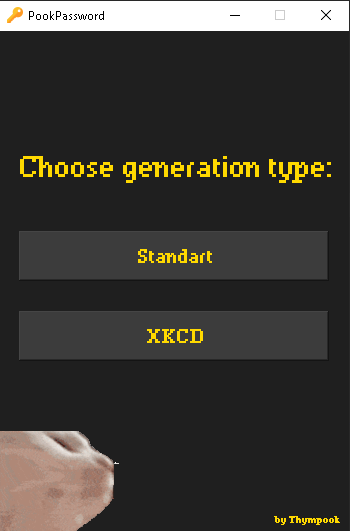
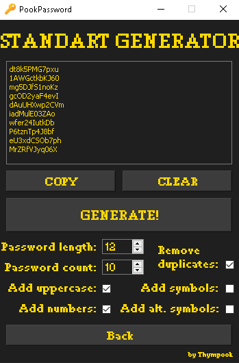
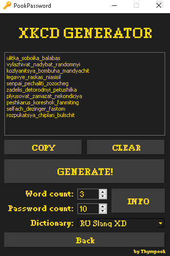

# Python - Password Generator


A simple program with a user interface for generating two types of passwords (Standart and XKCD)
## Features
* Random password generation
* Generating a large number of passwords (*up to **9999***)
* Customize the generation parameters to your liking
* Two types of generation
* Clear, minimalist interface
* A dancing kitty that will delight you 😻
* Open Source

## Standart generation

- It allows you to specify the character set by enabling/disabling character classes:
  - uppercase ASCII letters `A-Z`
  - lowercase ASCII letters `a-z`
  - digits `0-9`
  - basic punctuation ```%$#@!?&```
  - extended punctuation (seldom used) ```()*+./:;=>?@[\]^`{|}~```
- Allows you to set any password length you want (*up to **100** characters*).
- It allows you to generate passwords that contain only unique characters without repeats, while maintaining the specified password length (*up to **24** characters*)

## XKCD Generation
A flexible and scriptable password generator which generates strong passphrases, inspired by [XKCD 936](http://xkcd.com/936/)


### XKCD password dictionaries
- **ENG 12 Dicts** - [12Dicts](http://wordlist.aspell.net/12dicts/) by Alan Beale.
  - *contains 81883 words*
- **RU Holy Bible** - unique words from the complete Holy Bible transliterated from Cyrillic to Latin
  - *contains 52891 words*
- **RU Koran** - unique words from the Koran transliterated from Cyrillic to Latin
  - *contains 13920 words*
- **RU WarAndPeace** - unique words from Lev Tolstoy's novel "War and Peace" transliterated from Cyrillic to Latin
  - *contains 48713 words*
- **RU Slang XD** - unique slang words parsed from the [slang.su](https://slang.su/) website transliterated from Cyrillic to Latin
  - *contains 9958 words*

# How to use
Just run the `main.py` and enjoy!
## Main menu

## Standart Generation

## XKCD Generation

